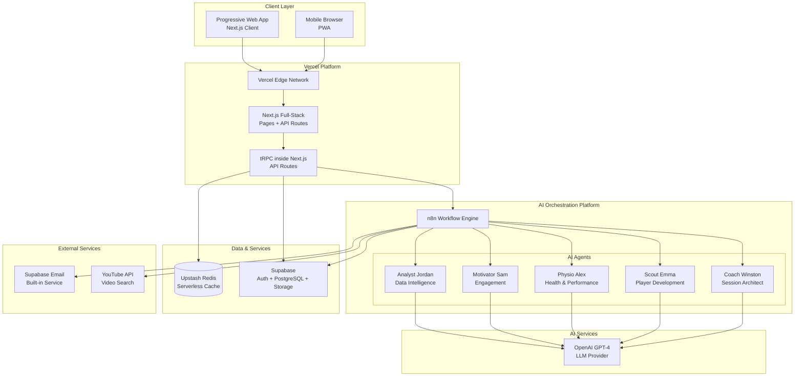
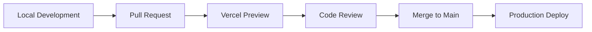

# Youth Soccer AI Platform Fullstack Architecture Document

This document outlines the complete fullstack architecture for Youth Soccer AI Platform, including backend systems, frontend implementation, and their integration. It serves as the single source of truth for AI-driven development, ensuring consistency across the entire technology stack.

This unified approach combines what would traditionally be separate backend and frontend architecture documents, streamlining the development process for modern fullstack applications where these concerns are increasingly intertwined.

## Starter Template or Existing Project

N/A - Greenfield project

### Change Log

| Date | Version | Description | Author |
|------|---------|-------------|--------|
| 2025-08-01 | 1.0 | Initial architecture document | Alex, Design Architect |
| 2025-08-02 | 1.1 | Simplified to Next.js full-stack for MVP | Winston, Architect |
| 2025-08-02 | 1.2 | Added n8n-based AI agent orchestration | Winston, Architect |

## High Level Architecture

### Technical Summary

The Youth Soccer AI Platform employs a simplified full-stack architecture using Next.js as both frontend and backend, deployed entirely on Vercel. This MVP approach maintains the same type-safe tRPC API layer but runs it within Next.js API routes instead of separate Lambda functions. The architecture leverages Supabase for authentication and PostgreSQL for data persistence. 

For AI capabilities, we utilize n8n as our agent orchestration platform, enabling visual workflow design for our five specialized AI agents (Coach Winston, Scout Emma, Physio Alex, Motivator Sam, and Analyst Jordan). These agents communicate through n8n workflows, calling OpenAI's GPT-4 and other services, with results stored in Supabase. This approach provides flexibility in agent design and rapid iteration without code changes.

**MVP Simplification:** The original design called for separate AWS Lambda functions, but for MVP we're consolidating everything into Next.js on Vercel, which provides the same serverless execution model with significantly less complexity.

### Platform and Infrastructure Choice

**Platform:** Vercel (Full-Stack) + n8n (AI Orchestration)
**Key Services:** Vercel (Next.js hosting with Edge Functions), Supabase (Auth + Database + Realtime), n8n (AI Agent Workflows), S3 (Media storage via Supabase Storage), OpenAI API (AI Planning)
**Deployment Host and Regions:** Primary: Vercel Global Edge Network, n8n Instance (Self-hosted or Cloud)

**Future Scale Path:** Can migrate to AWS Lambda + API Gateway architecture when needed without changing the tRPC API surface

### Repository Structure

**Structure:** Monorepo
**Monorepo Tool:** Turborepo (optimized build caching, ideal for Vercel deployment)
**Package Organization:** 
- Apps: web (Next.js full-stack)
- Packages: shared (types), ui (components), db (Prisma schema)

### High Level Architecture Diagram



### Architectural Patterns

- **Full-Stack Next.js:** Single deployment unit with unified frontend/backend - _Rationale:_ Dramatically simplifies deployment, monitoring, and debugging for MVP phase
- **API Routes as Backend:** Next.js API routes handle all backend logic - _Rationale:_ Serverless execution on Vercel, automatic scaling, no separate infrastructure
- **tRPC in API Routes:** Type-safe API layer runs inside Next.js - _Rationale:_ Maintains type safety benefits without separate service complexity
- **Component-Based UI:** React Server Components with client components where needed - _Rationale:_ Optimal performance with simplified data fetching
- **Repository Pattern:** Abstract all data access behind repository interfaces - _Rationale:_ Enables easy testing and potential future database migrations
- **Database via Supabase:** Direct PostgreSQL access through Prisma - _Rationale:_ Combines auth, database, and storage in one service
- **Edge Caching:** Leverage Vercel's edge caching for performance - _Rationale:_ Global performance without managing CDN
- **Offline-First PWA:** Service workers with background sync - _Rationale:_ Critical for coaches using app on fields without reliable internet

## Tech Stack

| Category | Technology | Version | Purpose | MVP Rationale |
|----------|------------|---------|---------|---------------|
| Language | TypeScript | 5.3+ | Type-safe development | Shared types across full stack |
| Framework | Next.js | 14.2+ | Full-stack React framework | Single deployment, built-in API routes, excellent DX |
| UI Library | Radix UI + Tailwind | Latest | Accessible components + utility CSS | Rapid development with accessibility built-in |
| State Management | Zustand + React Query | Latest | Client state + server cache | Simple, lightweight, perfect for MVP |
| API Layer | tRPC | 11.0+ | Type-safe API | Runs inside Next.js API routes |
| Database | PostgreSQL (Supabase) | 15+ | Primary data storage | Managed service with built-in auth |
| ORM | Prisma | 5.0+ | Database toolkit | Type-safe queries, migrations |
| Cache | Upstash Redis | Latest | Serverless cache | Works perfectly with Vercel |
| File Storage | Supabase Storage | Latest | Media storage | Integrated with auth, simpler than S3 |
| Authentication | Supabase Auth | 2.0+ | User auth | Complete auth solution |
| AI Orchestration | n8n | Latest | Visual workflow automation | Agent orchestration and complex AI flows |
| AI | OpenAI API | Latest | GPT-4 access | Called via n8n workflows |
| Email | Supabase Email | Built-in | Transactional email | Integrated with auth service |
| Testing | Vitest + Playwright | Latest | Unit/E2E testing | Fast, modern testing |
| Deployment | Vercel | Latest | Hosting platform | Automatic deployments, great Next.js support |
| Monitoring | Vercel Analytics + Sentry | Latest | Analytics & errors | Built-in with Vercel |

## Data Models

[Keep existing data models section unchanged]

## API Specification

### tRPC Router Structure (Inside Next.js)

```typescript
// apps/web/src/server/api/root.ts
import { createTRPCRouter } from './trpc';
import { authRouter } from './routers/auth';
import { clubRouter } from './routers/club';
import { sessionRouter } from './routers/session';
import { drillRouter } from './routers/drill';
import { playerRouter } from './routers/player';
import { aiRouter } from './routers/ai';

export const appRouter = createTRPCRouter({
  auth: authRouter,
  club: clubRouter,
  session: sessionRouter,
  drill: drillRouter,
  player: playerRouter,
  ai: aiRouter,
});

export type AppRouter = typeof appRouter;
```

### Next.js API Route Handler

```typescript
// apps/web/src/app/api/trpc/[trpc]/route.ts
import { fetchRequestHandler } from '@trpc/server/adapters/fetch';
import { appRouter } from '@/server/api/root';
import { createTRPCContext } from '@/server/api/trpc';

const handler = (req: Request) =>
  fetchRequestHandler({
    endpoint: '/api/trpc',
    req,
    router: appRouter,
    createContext: createTRPCContext,
  });

export { handler as GET, handler as POST };
```

## System Components

### Next.js Full-Stack Application

**Responsibility:** Complete web application serving both frontend and API
**Key Features:**
- Server Components for initial page loads
- Client Components for interactivity  
- API routes running tRPC
- Edge/Serverless functions on Vercel
- Built-in image optimization
- Automatic code splitting

**Technology Stack:** Next.js 14+, React 18+, TypeScript, tRPC

### Authentication (via Supabase)

**Responsibility:** Complete authentication and authorization
**Key Features:**
- JWT-based authentication
- Social login providers
- Row Level Security (RLS)
- Multi-tenant isolation
- Session management

**Technology Stack:** Supabase Auth, PostgreSQL RLS policies

### Database Layer

**Responsibility:** Data persistence and queries
**Key Features:**
- Prisma ORM for type-safe queries
- PostgreSQL via Supabase
- Automatic migrations
- Connection pooling (via Supabase)

**Technology Stack:** Prisma 5+, PostgreSQL 15+, Supabase

### AI Agent System (via n8n)

**Responsibility:** Multi-agent AI orchestration for intelligent coaching assistance
**Architecture:** Visual workflow-based agent system using n8n

**AI Agents:**
1. **Coach Winston** - Strategic session planning and drill progression
2. **Scout Emma** - Player development tracking and personalization
3. **Physio Alex** - Health monitoring and load management
4. **Motivator Sam** - Team morale and engagement optimization
5. **Analyst Jordan** - Performance analytics and insights

**Key Features:**
- Visual workflow design for rapid iteration
- Agent memory persistence in Supabase
- Multi-agent collaboration patterns
- Webhook-based communication with Next.js
- Parallel agent execution for complex tasks
- Built-in error handling and retries

**n8n Workflow Patterns:**
```yaml
Base Agent Template:
  - Webhook trigger (from Next.js)
  - Context retrieval (Supabase)
  - Agent personality injection
  - OpenAI completion
  - Response processing
  - Memory update
  - Webhook response

Multi-Agent Orchestration:
  - Parallel agent invocation
  - Result synthesis
  - Conflict resolution
  - Final output generation
```

**Integration with Next.js:**
```typescript
// Invoke n8n workflow from tRPC
const n8nClient = new N8NWorkflowClient();
const session = await n8nClient.triggerWorkflow(
  'coach-winston-session-generator',
  { teamId, duration, focus }
);
```

## Deployment Architecture

### Development Workflow



### Environment Strategy

1. **Local Development:** Next.js dev server with local Supabase + n8n Docker
2. **Preview Deployments:** Automatic Vercel previews per PR (shared n8n staging)
3. **Production:** Main branch auto-deploys to Vercel + dedicated n8n instance

### n8n Deployment Options

1. **Self-Hosted (Recommended for Control):**
   - Deploy on Railway/Fly.io/Render
   - PostgreSQL for n8n data persistence
   - Environment variables for API keys

2. **n8n Cloud (Recommended for Simplicity):**
   - Managed service with built-in scaling
   - Automatic backups and monitoring
   - Direct webhook URLs

### Simplified CI/CD

```yaml
# .github/workflows/ci.yml
name: CI
on: [push, pull_request]
jobs:
  test:
    runs-on: ubuntu-latest
    steps:
      - uses: actions/checkout@v3
      - uses: pnpm/action-setup@v2
      - run: pnpm install
      - run: pnpm test
      - run: pnpm build
```

## Migration Path to Scale

When the MVP needs to scale beyond Next.js API routes:

1. **Extract tRPC routers** to separate Lambda functions
2. **Add API Gateway** for route management
3. **Move background jobs** to SQS + Lambda
4. **Add Redis cluster** for distributed caching
5. **Implement read replicas** for database scaling

The beauty of this approach is that the tRPC API contracts remain identical - only the deployment changes.

## Security Considerations

- **Authentication:** Supabase Auth with RLS policies
- **API Security:** tRPC procedures with auth middleware
- **Environment Variables:** Managed via Vercel dashboard
- **CORS:** Configured in Next.js config
- **Rate Limiting:** Via Upstash Redis + Vercel Edge Middleware

## Performance Optimization

- **Static Generation:** For marketing pages
- **ISR:** For drill library and content
- **React Server Components:** Reduce client bundle
- **Edge Caching:** Vercel's automatic caching
- **Image Optimization:** Next.js built-in optimization
- **Database Indexes:** Via Prisma schema

## Development Setup

```bash
# Clone repository
git clone <repo>
cd project-unify

# Install dependencies
pnpm install

# Setup environment variables
cp apps/web/.env.example apps/web/.env.local

# Run database migrations
pnpm db:push

# Start development
pnpm dev
```

## Cost Optimization for MVP

- **Vercel Free Tier:** Perfect for MVP traffic
- **Supabase Free Tier:** 500MB database, 2GB bandwidth
- **n8n:** Self-hosted ~$5-10/month or Cloud starter $20/month
- **OpenAI API:** Pay-per-use, ~$0.03 per session plan
- **Upstash Free Tier:** 10,000 commands/day

Total estimated monthly cost for MVP: **< $75** (self-hosted n8n) or **< $100** (n8n cloud)

## Conclusion

This architecture combines the simplicity of Next.js full-stack development with the power of visual AI agent orchestration through n8n. The result is a system that's both developer-friendly and capable of sophisticated AI interactions.

Key architectural decisions:
1. **Next.js on Vercel** provides serverless scaling without Lambda complexity
2. **n8n for AI agents** enables rapid iteration on agent behavior without code changes
3. **Supabase** consolidates auth, database, and storage into one managed service
4. **tRPC** maintains type safety across the entire stack

The beauty of this approach is its flexibility - we can visually design complex AI agent interactions in n8n while maintaining a clean, type-safe API surface in Next.js. When scaling is needed, both Vercel and n8n can grow with demand, and the architecture supports migration to more complex infrastructure if required.