# Deployment Architecture

## Development Workflow

```mermaid
graph LR
    Dev[Local Development] --> Commit[Git Commit]
    Commit --> PR[Pull Request]
    PR --> GHA[GitHub Actions]
    GHA --> Build[Docker Build<br/>+ Run Tests]
    Build --> GHCR[Push to ghcr.io]
    GHCR --> Deploy[Deploy via Portainer]
    Deploy --> Preview[Preview Environment]
    Preview --> E2E[Run E2E Tests]
    E2E --> Review[Code Review]
    Review --> Merge[Merge to Main]
    Merge --> Prod[Production Deploy]
```



## Environment Strategy

1. **Local Development (docker-compose.dev.yml):**
   - **App:** Run directly with `pnpm dev` for hot reloading and debugging
   - **Services:** PostgreSQL, Redis, MailHog, n8n in Docker containers
   - **Database:** `soccer` database with seed data
   - **Email:** MailHog captures all emails locally
   - **Access:** http://localhost:3000

2. **Preview Deployment (docker-stack.preview.yml):**
   - **App:** Production build from GitHub Container Registry
   - **Deployment:** Single preview environment via Portainer API
   - **Database:** `soccer` database (reset on each deployment)
   - **Email:** MailHog for testing (no real emails sent)
   - **Tests:** Full E2E test suite runs after deployment
   - **Access:** https://preview.soccer-unify.com via Cloudflare

3. **Production (docker-stack.prod.yml):**
   - **App:** Production build with 3 replicas for high availability
   - **Deployment:** Main branch auto-deploys via Portainer
   - **Database:** `soccer` database with automated backups
   - **Email:** Real SMTP service for transactional emails
   - **Monitoring:** Prometheus + Grafana enabled
   - **Access:** https://soccer-unify.com via Cloudflare

## Multi-Stage Docker Build

```dockerfile