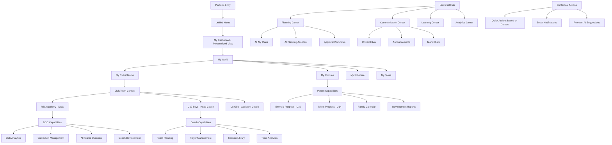
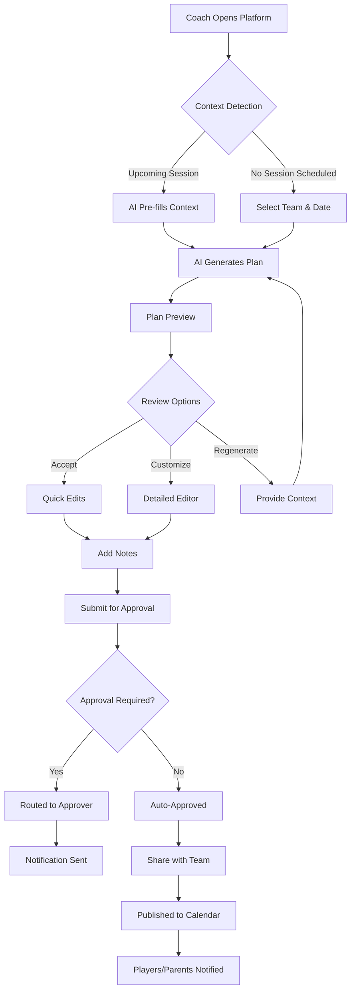
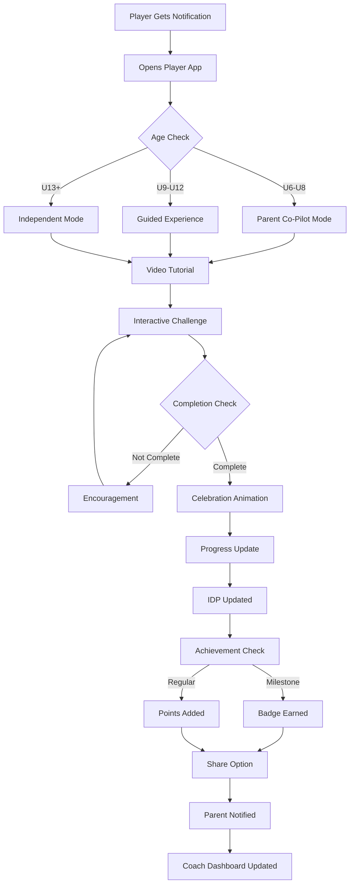
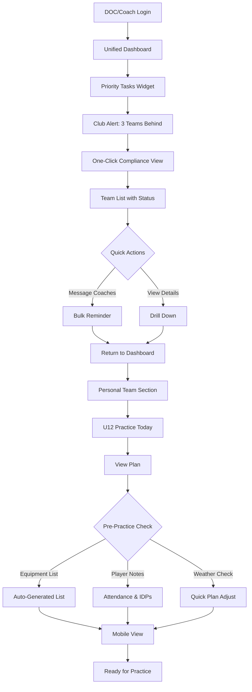

# Youth Soccer AI Platform UI/UX Specification

This document defines the user experience goals, information architecture, user flows, and visual design specifications for Youth Soccer AI Platform's user interface. It serves as the foundation for visual design and frontend development, ensuring a cohesive and user-centered experience.

## Overall UX Goals & Principles

### Target User Personas

**1. The Director of Coaching (DOC) - "The Strategic Visionary"**
- Experienced, licensed professionals managing 10-50+ coaches
- Need bird's-eye view of club-wide implementation
- Value data-driven insights and standardization
- Time-constrained but detail-oriented

**2. The Coach - Two Sub-Personas:**
- **Professional Coach "The Educator"**: Paid, licensed, values efficiency with flexibility
- **Volunteer Coach "The Parent Helper"**: Limited time, needs simplicity and guidance

**3. The Player - "The Digital Native"**
- Age segments: U6-U8 (playful), U9-U12 (engaged), U13-U19 (competitive)
- Expects gamification and instant feedback
- Mobile-first, visual learners
- Short attention spans requiring engaging content

**4. The Parent - "The Invested Supporter"**
- Primary economic stakeholder
- Wants transparency and value demonstration
- Varying technical comfort levels
- Needs clear communication channels

### Usability Goals

1. **Ease of learning:** Volunteer coaches can create their first AI-generated session plan within 5 minutes
2. **Efficiency of use:** DOCs can review club-wide compliance in under 2 minutes via dashboard
3. **Error prevention:** AI suggestions always require coach review before sharing with players/parents
4. **Memorability:** Seasonal coaches can return after months and immediately resume planning
5. **Player engagement:** 70% of players complete weekly homework within 48 hours of assignment

### Design Principles

**Core Principles (Soccer-Specific):**

1. **Soccer-First Simplicity** - Every interface decision prioritizes soccer knowledge over tech complexity
2. **Progressive Empowerment** - Start with AI automation, gradually reveal customization options
3. **Visual Communication** - Use videos, diagrams, and field layouts over text wherever possible
4. **Mobile-Responsive Reality** - Design for the sideline first (phones/tablets in weather conditions)
5. **Trust Through Transparency** - Always show the "why" behind AI recommendations

**Universal Design Principles (Ensuring Seamless Experience):**

6. **Equitable Use** - The platform is equally usable by coaches with varying technical skills, from tech-savvy professionals to volunteer parents. All core functions work without requiring advanced digital literacy.

7. **Flexibility in Use** - Accommodates both quick 2-minute session planning for experienced coaches and detailed 15-minute guided workflows for beginners. Users can toggle between AI-automated and manual modes.

8. **Simple and Intuitive Use** - Soccer terminology takes precedence over tech jargon. Icons use universal soccer symbols (ball, field, whistle) rather than abstract UI elements.

9. **Perceptible Information** - Critical information is communicated through multiple channels: visual (colors, icons), textual (labels), and spatial (layout). Video demonstrations supplement written instructions.

10. **Tolerance for Error** - All destructive actions require confirmation. Session plans auto-save every 30 seconds. "Undo" is available for all major actions. AI suggestions are always presented as options, never auto-applied.

11. **Low Physical Effort** - Designed for one-handed operation on mobile devices (coaches often hold equipment). Common actions require minimal taps. Voice input available for session notes.

12. **Size and Space** - Touch targets minimum 44x44px for mobile use with cold/wet fingers. Clear visual hierarchy with generous whitespace. Readable at arm's length in bright sunlight.

**Seamless Experience Framework:**

- **Contextual Continuity:** Users can start planning on desktop, continue on tablet at the field, and share via mobile without losing context
- **Role-Based Adaptation:** Interface automatically adjusts complexity based on user role (DOC sees analytics, volunteer coach sees simplified options)
- **Predictive Assistance:** AI learns from user patterns to pre-populate common selections
- **Unified Visual Language:** Consistent iconography, color coding, and interaction patterns across all touchpoints

### Change Log

| Date | Version | Description | Author |
|------|---------|-------------|--------|
| 2025-08-01 | 1.0 | Initial UI/UX specification created | Sally, UX Expert |
| 2025-08-01 | 1.1 | Added Universal Design Principles | Sally, UX Expert |

## Information Architecture (IA)

### Site Map / Screen Inventory

**Key Design Decision:** Unified Experience with Contextual Intelligence - No explicit role switching required



### Navigation Structure

**Primary Navigation - Context-Aware Universal Bar:**

1. **Home** - Unified dashboard showing all relevant information
2. **Planning** - Shows all plans (club-wide if DOC, team-specific if coach, child-specific if parent)
3. **Teams & People** - Hierarchical view based on your highest role
4. **Schedule** - Unified calendar with role-based filtering
5. **Analytics** - Adapts based on what you have access to
6. **AI Assistant** - Context-aware based on current view

**Seamless Multi-Role Experience Patterns:**

1. **Contextual Elevation** - When viewing your child's team as a parent, if you're also that team's coach, you see a subtle "Coach Tools" expansion option

2. **Smart Information Layering** - Information displays at the appropriate level:
   - As DOC viewing a team: See compliance metrics + coach tools
   - As Coach who is also parent: See team view with your child highlighted
   - As Parent who assists coaching: See parent view with "Assistant Coach" badge

3. **Unified Task List** - Single task list intelligently categorized:
   - 📊 Review club-wide session compliance (DOC)
   - 📋 Approve U12 week 3 plan (Coach)
   - ⚽ Complete passing homework (Player - if applicable)
   - 👨‍👩‍👧 Sign Jake's tournament form (Parent)

**Breadcrumb Strategy:**
- **Smart Context Path** - Shows logical path with role context embedded
- Example: "RSL Academy > U12 Boys > Week 3 Plan" (with small "Coach" badge)
- **Quick Jump** - Breadcrumbs act as navigation to switch contexts quickly

**Age-Appropriate Adaptations:**
- **U6-U8 Interface:** Large icons, minimal text, parent co-pilot mode enabled by default
- **U9-U12 Interface:** Balanced visual/text, achievement system visible, guided workflows
- **U13+ Interface:** Full feature set, advanced analytics, social features, leadership tools

## User Flows

### Flow 1: AI-Powered Session Planning (Coach Journey)

**User Goal:** Create a week's session plan in under 5 minutes using AI assistance

**Entry Points:** 
- Dashboard "Quick Plan" widget
- Planning Center > New Plan
- AI Assistant conversation
- Team calendar empty slot

**Success Criteria:** AI-generated plan reviewed, customized, and approved



**Edge Cases & Error Handling:**
- No internet connection: Local draft saved, sync when connected
- Incomplete curriculum: AI suggests generic age-appropriate activities with warning
- Approval delay: Coach can share "pending approval" version with disclaimer
- Weather change: Quick Plan templates for rain/heat alternatives

**Notes:** The flow adapts based on coach experience level - volunteer coaches get more guidance, professional coaches see advanced options immediately

### Flow 2: Player Homework Completion (Player Journey)

**User Goal:** Complete weekly homework assignment in an engaging way

**Entry Points:**
- Push notification
- Player dashboard "Today's Focus"
- Parent reminder
- Team chat mention

**Success Criteria:** Homework completed, progress tracked, achievement earned



**Edge Cases & Error Handling:**
- Video won't load: Fallback to image sequence with text
- Parent not available (U6-U8): "Save for later" with parent notification
- Multiple attempts needed: Each attempt logged positively as "practice"
- Technical difficulties: AI Assistant offers alternative completion method

### Flow 3: Multi-Role Quick View (DOC who Coaches)

**User Goal:** Check club compliance then review own team's plan in one session

**Entry Points:**
- Morning login routine
- Compliance alert notification
- Pre-practice check

**Success Criteria:** Both DOC and Coach tasks completed efficiently without role switching



**Notes:** No mode switching required - seamless transition between DOC and Coach views based on context

## Wireframes & Mockups

### Design Tool Strategy

**Primary Design Files:** Will be created in Figma/Sketch for detailed visual design
- Recommended: Figma for collaborative design and developer handoff
- Alternative: Can generate AI UI using v0.dev or Lovable based on these specifications

### Key Screen Layouts

#### 1. Unified Dashboard (Home)

**Purpose:** Single entry point showing all relevant information based on user's complete context

**Key Elements:**
- Dynamic greeting with context awareness ("Good morning Coach Sarah, ready for U12 practice?")
- Priority tasks widget (adapts based on roles and time of day)
- Quick action cards (AI Plan, View Schedule, Check Progress)
- Multi-context summary cards (Club Health, My Teams, My Children)
- Weather widget with field conditions
- Announcement banner (if new)

**Interaction Notes:** 
- Cards expand/collapse based on relevance and user patterns
- Drag to reorder for personalization
- One-tap access to most common tasks
- Progressive disclosure of advanced features

**Design File Reference:** Dashboard-MultiRole-Mobile & Dashboard-MultiRole-Desktop

#### 2. AI Planning Interface

**Purpose:** Streamlined session planning with AI assistance

**Key Elements:**
- Context bar showing Team/Date/Phase
- AI suggestion panel with rationale
- Visual session builder (drag-drop drills)
- Video preview thumbnails
- Time allocation visualizer
- Equipment list generator
- Approval status indicator
- Quick adjustment tools (weather, attendance)

**Interaction Notes:**
- Split view on desktop: AI suggestions left, editor right
- Mobile: Tabbed interface between AI and editor
- Voice input for contextual notes
- Auto-save indicator always visible

**Design File Reference:** Planning-AI-Desktop & Planning-AI-Mobile

#### 3. Player Experience (Age-Adapted)

**Purpose:** Engaging, age-appropriate interface for homework and progress tracking

**Key Elements (U6-U8):**
- Large visual blocks with minimal text
- Avatar/mascot guide
- Parent co-pilot indicator
- Video-first content
- Simple tap interactions
- Celebration animations

**Key Elements (U9-U12):**
- Balanced text/visual
- Progress bars and achievements
- Team leaderboard (optional)
- Skill tree visualization
- Quiz interface with hints

**Key Elements (U13+):**
- Full analytics access
- Social features
- Video upload for self-assessment
- Leadership tools
- College prep tracking

**Interaction Notes:**
- Swipe navigation between activities
- Haptic feedback for achievements
- Offline mode for video content

**Design File Reference:** Player-AgeGroups-Mobile

#### 4. DOC Analytics Dashboard

**Purpose:** Comprehensive oversight of club development and compliance

**Key Elements:**
- Club health score (large visual indicator)
- Compliance heat map by team
- Curriculum adoption metrics
- Development trend graphs
- Coach activity timeline
- Quick filters (age group, time period)
- Drill-down navigation
- Export/report generation

**Interaction Notes:**
- Interactive charts with touch/hover details
- Pinch to zoom on mobile
- Customizable widget arrangement
- Real-time updates

**Design File Reference:** DOC-Analytics-Desktop & DOC-Analytics-Tablet

#### 5. Parent Portal

**Purpose:** Transparency and engagement for soccer parents

**Key Elements:**
- Family calendar view
- Child progress cards (multiple children)
- This week's focus with video
- Communication feed
- Document center (forms, permissions)
- Payment status (if applicable)
- AI Assistant chat bubble

**Interaction Notes:**
- Swipe between children
- Quick RSVP for events
- Share achievements to social
- Print-friendly views

**Design File Reference:** Parent-Portal-Mobile

### Universal Design Implementation in Layouts:

1. **Consistent Component Library:**
   - Buttons: Minimum 48px height, clear labels + icons
   - Cards: Elevated with clear boundaries
   - Forms: Inline validation, clear error states
   - Navigation: Fixed position, always accessible

2. **Responsive Grid System:**
   - Mobile: 4-column grid with 16px gutters
   - Tablet: 8-column grid with 24px gutters  
   - Desktop: 12-column grid with 32px gutters

3. **Visual Hierarchy:**
   - Primary actions: High contrast, prominent placement
   - Secondary actions: Subdued but findable
   - Information density: Adjustable via settings

4. **Loading & Error States:**
   - Skeleton screens while loading
   - Friendly error messages with solutions
   - Offline indicators with cached content

## Component Library / Design System

### Design System Approach

**Design System Approach:** Custom "Soccer First" Design System built on Material Design 3 foundation
- Extends Material Design with soccer-specific components and patterns
- Ensures consistency while maintaining familiarity for users
- Supports theming for club branding while maintaining core usability
- Progressive Web App optimized components

### Core Components

#### 1. Navigation Components

**Purpose:** Consistent wayfinding across all contexts and devices

**Variants:** 
- Desktop horizontal bar with dropdowns
- Mobile bottom navigation with FAB
- Tablet hybrid (side + bottom)
- Contextual breadcrumbs

**States:** Default, Active, Loading, Offline, Has-Updates

**Usage Guidelines:** 
- Primary nav always visible except in focused tasks (video viewing, quiz taking)
- Context badges appear when user has multiple roles
- Offline indicator shows cached content availability

#### 2. Card System

**Purpose:** Flexible content containers that adapt to different information types

**Variants:**
- Summary Card (dashboard widgets)
- Action Card (quick tasks)
- Player Card (roster display)
- Drill Card (with video preview)
- Analytics Card (with mini charts)
- Notification Card (dismissible)

**States:** Default, Hover/Pressed, Expanded, Loading, Error, Offline-Cached

**Usage Guidelines:**
- Maintain 8dp elevation for primary cards
- Use 16dp internal padding
- Support swipe gestures on mobile for quick actions
- Always include fallback content for failed loads

#### 3. Form Controls

**Purpose:** Consistent, accessible input methods optimized for soccer contexts

**Variants:**
- Text Input (with voice option)
- Soccer Field Position Picker
- Duration Slider (5-90 min)
- Player Multi-Select
- Date/Time Picker (practice-aware)
- Drill Intensity Scale (1-5 with icons)

**States:** Empty, Focused, Filled, Error, Disabled, Loading

**Usage Guidelines:**
- Minimum 48px touch targets
- Inline validation with helpful messages
- Smart defaults based on context
- Voice input for longer text fields

#### 4. AI Assistant Interface

**Purpose:** Consistent AI interaction pattern across all user roles

**Variants:**
- Floating bubble (collapsed)
- Side panel (desktop)
- Full screen (mobile)
- Inline suggestions
- Quick actions toolbar

**States:** Idle, Listening, Thinking, Responding, Error

**Usage Guidelines:**
- Role-appropriate personality and vocabulary
- Visual typing indicator
- Suggested prompts based on context
- Clear AI vs human-generated content indicators

#### 5. Progress & Feedback Components

**Purpose:** Motivate users and show system status

**Variants:**
- Linear progress (tasks, uploads)
- Circular progress (achievements)
- Step indicators (workflows)
- Success animations (player rewards)
- Skeleton screens (loading)

**States:** Empty, In-Progress, Complete, Error

**Usage Guidelines:**
- Always show progress for operations >2 seconds
- Celebrate completions appropriately by age group
- Provide time estimates when possible
- Allow background processing

#### 6. Soccer-Specific Components

**Purpose:** Domain-specific UI elements that enhance usability

**Variants:**
- Interactive Field Diagram
- Formation Builder
- Drill Animator
- Equipment Checklist
- Weather-Adapted Plan Selector
- Video Clip Trimmer

**States:** Interactive, Display-Only, Editing, Annotating

**Usage Guidelines:**
- Field diagrams use standard FIFA proportions
- Support both tactical (2D) and perspective (3D) views
- Enable quick annotation with preset symbols
- Optimize for outdoor screen visibility

#### 7. Data Visualization

**Purpose:** Make analytics accessible to all user types

**Variants:**
- Compliance Heat Map
- Development Spider Chart
- Activity Timeline
- Comparison Bar Charts
- Trend Lines
- Player Progress Rings

**States:** Loading, Interactive, Static, Filtered, Exported

**Usage Guidelines:**
- Use soccer-relevant metaphors (field heat maps)
- Ensure colorblind-safe palettes
- Provide text alternatives for all charts
- Support drill-down interactions

#### 8. Communication Components

**Purpose:** Foster clear communication between all stakeholders

**Variants:**
- Announcement Banner
- Comment Thread
- Quick Message
- Bulk Notification
- Team Chat Bubble
- Parent Notice

**States:** Unread, Read, Typing, Sending, Delivered, Failed

**Usage Guidelines:**
- Clear read/unread indicators
- Support rich media (images, videos)
- Threaded conversations for context
- Appropriate notification levels

### Design Token Structure

```
Soccer Platform Design Tokens:

Colors:
- primary/field-green: #2E7D32
- primary/sky-blue: #0288D1  
- accent/goal-gold: #FFB300
- semantic/success: #43A047
- semantic/warning: #FB8C00
- semantic/error: #E53935

Spacing:
- xs: 4px (tight layouts)
- sm: 8px (internal padding)
- md: 16px (standard gap)
- lg: 24px (section spacing)
- xl: 32px (major sections)

Typography Scale:
- display: 32px/40px (dashboard headers)
- title: 24px/32px (section titles)
- body: 16px/24px (standard text)
- caption: 14px/20px (helper text)
- micro: 12px/16px (metadata)

Elevation:
- flat: 0dp (backgrounds)
- raised: 4dp (buttons)
- card: 8dp (primary containers)
- modal: 16dp (overlays)
- nav: 24dp (app bars)
```

## Branding & Style Guide

### Visual Identity

**Brand Guidelines:** Platform brand serves as foundation, with club customization layer
- Core platform identity remains consistent for trust and recognition
- Clubs can overlay their colors, logos, and imagery
- Balance between platform professionalism and club personality

### Color Palette

| Color Type | Hex Code | Usage |
|------------|----------|--------|
| Primary | #2E7D32 | Field green - primary actions, headers, success states |
| Secondary | #0288D1 | Sky blue - links, secondary actions, information |
| Accent | #FFB300 | Goal gold - achievements, highlights, celebrations |
| Success | #43A047 | Positive feedback, completed tasks, confirmations |
| Warning | #FB8C00 | Important notices, deadlines, weather alerts |
| Error | #E53935 | Errors, required fields, destructive actions |
| Neutral | #212121, #757575, #BDBDBD, #F5F5F5 | Text hierarchy, borders, backgrounds |

**Club Customization Layer:**
- Clubs can define accent color override
- Club logo appears in designated areas
- Background patterns can use club colors at 10% opacity

### Typography

#### Font Families
- **Primary:** Inter or system font stack (San Francisco, Roboto, Segoe UI)
  - Clean, modern, excellent readability on all devices
  - Variable font for performance optimization
- **Secondary:** Source Sans Pro
  - Used for longer reading content
  - Slightly warmer personality
- **Monospace:** JetBrains Mono or system monospace
  - Code snippets, IDs, technical information

#### Type Scale

| Element | Size | Weight | Line Height | Usage |
|---------|------|---------|-------------|--------|
| H1 | 32px | 700 | 40px | Dashboard headers, page titles |
| H2 | 24px | 600 | 32px | Section headers |
| H3 | 20px | 600 | 28px | Card titles, subsections |
| Body | 16px | 400 | 24px | Primary content |
| Small | 14px | 400 | 20px | Captions, metadata |
| Micro | 12px | 400 | 16px | Timestamps, labels |

**Responsive Type Scale:**
- Mobile: Reduce H1 to 28px, H2 to 22px
- Maintain minimum 16px for body text (accessibility)

### Iconography

**Icon Library:** Custom soccer-themed icon set extending Material Icons
- Base: Material Icons Rounded (friendly, approachable)
- Custom additions: Soccer-specific icons

**Usage Guidelines:**
1. **Functional Icons:**
   - Navigation: Home, Calendar, Analytics, Messages
   - Actions: Add, Edit, Delete, Share, Download
   - Status: Success (checkmark), Warning (!), Error (X)

2. **Soccer Icons:**
   - Field diagram, Soccer ball, Whistle, Goal, Cone
   - Formation positions, Tactics board, Stopwatch
   - Trophy, Medal, Star (achievements)

3. **Size Standards:**
   - Small: 20px (inline with text)
   - Medium: 24px (buttons, lists)
   - Large: 48px (empty states, features)

4. **Color Usage:**
   - Inherit text color for neutral actions
   - Use semantic colors for status
   - Primary color for selected/active states

### Spacing & Layout

**Grid System:** 8px base unit system
- Consistent spacing creates visual rhythm
- Scales predictably across breakpoints

**Spacing Scale:**
```
xs: 4px   (tight groups)
sm: 8px   (related items)
md: 16px  (standard spacing)
lg: 24px  (section breaks)
xl: 32px  (major sections)
xxl: 48px (page sections)
```

**Layout Principles:**
1. **Information Density:**
   - Desktop: Maximize information display
   - Tablet: Balanced density
   - Mobile: Prioritized, scannable content

2. **White Space:**
   - Generous padding in touch areas
   - Clear separation between sections
   - Breathing room for outdoor readability

3. **Responsive Behavior:**
   - Mobile-first design approach
   - Content reflows, never hidden
   - Maintain hierarchy across sizes

### Visual Style Elements

**Elevation & Shadows:**
```css
/* Subtle shadows for depth */
shadow-sm: 0 1px 2px rgba(0,0,0,0.05)
shadow-md: 0 4px 6px rgba(0,0,0,0.07)
shadow-lg: 0 10px 15px rgba(0,0,0,0.1)
shadow-xl: 0 20px 25px rgba(0,0,0,0.1)
```

**Border Radius:**
- Small elements (buttons, inputs): 4px
- Cards and containers: 8px
- Modals and overlays: 12px
- Never fully rounded (except avatar images)

**Imagery Guidelines:**
1. **Photography:**
   - Authentic youth soccer moments
   - Diverse representation
   - Action-oriented, positive energy
   - Natural lighting preferred

2. **Illustrations:**
   - Simple, geometric style
   - Limited color palette
   - Used for empty states, onboarding
   - Avoid overly playful/childish

3. **Video Thumbnails:**
   - 16:9 aspect ratio standard
   - Clear play button overlay
   - Duration badge in corner
   - High contrast for outdoor viewing

### Motion & Animation

**Animation Principles:**
- Purpose-driven, not decorative
- Enhance understanding of state changes
- Respect reduce-motion preferences
- Performance over complexity

**Standard Transitions:**
```css
/* Micro-interactions */
transition-fast: 150ms ease-out
transition-base: 250ms ease-out
transition-slow: 350ms ease-out

/* Page transitions */
fade-in: 300ms ease-out
slide-up: 350ms ease-out
scale-in: 250ms ease-out
```

**Loading States:**
- Skeleton screens for content loading
- Progress indicators for actions
- Subtle pulse animation for pending items

### Accessibility Considerations

**Color Contrast:**
- WCAG AA minimum (4.5:1 for normal text)
- WCAG AAA for critical actions (7:1)
- Test all color combinations
- Provide non-color indicators

**Focus States:**
- 2px solid outline in primary color
- 2px offset for breathing room
- High contrast against all backgrounds
- Visible in bright sunlight

**Touch Targets:**
- Minimum 44x44px on mobile
- 48px preferred for primary actions
- Adequate spacing between targets
- Consider gloved hands in cold weather

### Brand Voice & Tone

**Platform Personality:**
- Professional yet approachable
- Encouraging without patronizing
- Clear and concise
- Soccer-knowledgeable

**Tone Variations by User:**
- DOC: Data-driven, strategic
- Coach: Supportive, practical
- Player: Motivating, fun (age-appropriate)
- Parent: Informative, reassuring

## Accessibility Requirements

### Compliance Target

**Standard:** WCAG 2.1 AA as baseline, with AAA for critical user paths
- Legal compliance with ADA and international standards
- Beyond compliance: Focus on real-world usability
- Regular audits with actual users including those with disabilities
- Progressive enhancement approach

### Key Requirements

**Visual:**
- **Color contrast ratios:** 
  - Normal text: 4.5:1 minimum (AA)
  - Large text (18px+): 3:1 minimum
  - Critical actions: 7:1 (AAA)
  - Outdoor mode: Enhanced contrast option for bright sunlight
  
- **Focus indicators:**
  - 2px solid outline with 2px offset
  - High contrast color that works on all backgrounds
  - Custom focus styles for soccer field diagrams
  - Never rely on color alone

- **Text sizing:**
  - Base font 16px minimum
  - User-adjustable up to 200% without horizontal scroll
  - Relative units (rem/em) for scalability
  - Maintain readability at all zoom levels

**Interaction:**
- **Keyboard navigation:**
  - All interactive elements keyboard accessible
  - Logical tab order following visual flow
  - Skip links for repetitive content
  - Custom shortcuts for power users (customizable)
  - Escape key consistently closes modals/overlays

- **Screen reader support:**
  - Semantic HTML structure
  - ARIA labels for complex interactions
  - Live regions for dynamic updates
  - Descriptive link text (never "click here")
  - Alternative text for all soccer diagrams

- **Touch targets:**
  - Minimum 44x44px (Apple HIG)
  - 48x48px preferred (Material Design)
  - 8px minimum spacing between targets
  - Larger targets for younger age groups
  - Consider cold weather/gloved hands

**Content:**
- **Alternative text:**
  - Descriptive alt text for all images
  - Extended descriptions for complex diagrams
  - Video captions and transcripts
  - Audio descriptions for key visual content

- **Heading structure:**
  - Logical H1-H6 hierarchy
  - One H1 per page
  - No skipped levels
  - Descriptive headings for navigation

- **Form labels:**
  - All inputs have associated labels
  - Required fields clearly marked (not color only)
  - Inline validation with clear error messages
  - Instructions before form fields
  - Group related fields with fieldsets

### Additional Accessibility Features

**Cognitive Accessibility:**
- Clear, simple language (appropriate reading level)
- Consistent navigation and layout patterns
- Progress indicators for multi-step processes
- Auto-save to prevent data loss
- Undo functionality for critical actions
- Help available in context

**Motor Accessibility:**
- Large click/tap areas
- Minimize precision requirements
- Drag alternatives for touch interactions
- Voice input options where appropriate
- Adjustable timeouts for timed activities
- One-handed operation possible

**Sensory Accommodations:**
- Visual alerts have audio/haptic alternatives
- Audio cues have visual indicators
- Reduce motion option for animations
- High contrast mode available
- Dark mode for light sensitivity
- Adjustable font choices for dyslexia

### Age-Specific Accessibility

**U6-U8 Players:**
- Extra large touch targets (60px+)
- Minimal text, maximum visuals
- Parent assistance mode built-in
- Simple audio instructions
- No time pressure

**U9-U12 Players:**
- Adjustable reading levels
- Visual progress indicators
- Hints and help readily available
- Celebration animations (with option to disable)

**U13+ Players:**
- Full accessibility options menu
- Customizable interface preferences
- Study mode for reduced distractions

### Testing Strategy

**Automated Testing:**
- axe-core integration in development
- Lighthouse CI in build pipeline
- Automated contrast checking
- HTML validation for semantics

**Manual Testing:**
- Keyboard-only navigation testing
- Screen reader testing (NVDA, JAWS, VoiceOver)
- Mobile accessibility testing
- Real user testing with disabilities

**User Testing Protocol:**
- Include users with disabilities in all testing phases
- Test with actual assistive technologies
- Outdoor/field condition testing
- Multi-device testing scenarios
- Age-appropriate testing groups

### Implementation Guidelines

**Development Standards:**
```html
<!-- Good: Semantic with ARIA enhancement -->
<button 
  aria-label="Create new session plan for U12 team"
  aria-pressed="false"
  class="btn-primary"
>
  <svg aria-hidden="true">...</svg>
  <span>New Plan</span>
</button>

<!-- Soccer field diagram example -->
<div role="img" aria-label="Soccer field formation 4-3-3">
  <svg><!-- Interactive field --></svg>
  <div class="sr-only">
    Detailed formation description for screen readers...
  </div>
</div>
```

**Progressive Enhancement Layers:**
1. Core functionality works without JavaScript
2. Enhanced interactions for modern browsers
3. Offline capability for basic features
4. Graceful degradation for older devices

### Accessibility Statement

Platform will maintain a public accessibility statement including:
- Our commitment to accessibility
- Compliance standards met
- Known limitations and workarounds
- Contact information for accessibility issues
- Timeline for addressing reported barriers

## Responsiveness Strategy

### Breakpoints

| Breakpoint | Min Width | Max Width | Target Devices |
|------------|-----------|-----------|----------------|
| Mobile | 320px | 767px | Phones (field use, parent check-ins) |
| Tablet | 768px | 1023px | iPads (coach sideline use) |
| Desktop | 1024px | 1439px | Laptops (office planning) |
| Wide | 1440px | - | Large monitors (DOC analytics) |

**Key Breakpoint Decisions:**
- 768px chosen as tablet breakpoint (iPad portrait)
- 1024px for desktop (common laptop resolution)
- Content-first approach: breakpoints based on content needs, not device sizes

### Adaptation Patterns

**Layout Changes:**

1. **Mobile (320-767px):**
   - Single column layout
   - Stacked navigation (bottom bar)
   - Full-width cards and forms
   - Collapsed sections with accordions
   - Touch-optimized with large tap areas

2. **Tablet (768-1023px):**
   - 2-column layouts where beneficial
   - Side navigation drawer
   - Modal overlays for complex forms
   - Floating action buttons
   - Split-view for coach planning

3. **Desktop (1024-1439px):**
   - 3-column layouts for dashboards
   - Persistent side navigation
   - Multi-panel views
   - Hover states enabled
   - Keyboard shortcuts active

4. **Wide (1440px+):**
   - Maximum content width: 1280px centered
   - Additional sidebar widgets
   - Extended data tables
   - Picture-in-picture video
   - Multiple workflow panels

**Navigation Changes:**

- **Mobile:** Bottom navigation bar with 5 max items + overflow menu
- **Tablet:** Collapsible side drawer with icons + labels
- **Desktop:** Full side navigation with nested menus
- **Wide:** Dual navigation (side + top for contexts)

**Content Priority:**

Mobile-first content hierarchy:
1. **Critical:** Current task/action
2. **Important:** Contextual information
3. **Nice-to-have:** Additional options
4. **Hidden:** Advanced features (progressive disclosure)

**Interaction Changes:**

- **Touch (Mobile/Tablet):**
  - Swipe gestures for navigation
  - Pull-to-refresh
  - Long press for context menus
  - Larger touch targets (min 48px)

- **Mouse (Desktop/Wide):**
  - Hover previews
  - Right-click context menus
  - Drag-and-drop planning
  - Multi-select with shift/ctrl

### Responsive Components

**1. Dashboard Cards:**
```css
/* Mobile: Stack vertically */
.dashboard-card {
  width: 100%;
  margin-bottom: 16px;
}

/* Tablet: 2-column grid */
@media (min-width: 768px) {
  .dashboard-grid {
    display: grid;
    grid-template-columns: repeat(2, 1fr);
    gap: 16px;
  }
}

/* Desktop: 3-column with featured */
@media (min-width: 1024px) {
  .dashboard-grid {
    grid-template-columns: repeat(3, 1fr);
  }
  .featured-card {
    grid-column: span 2;
  }
}
```

**2. Navigation Transformation:**
```css
/* Mobile: Bottom bar */
.nav-primary {
  position: fixed;
  bottom: 0;
  height: 56px;
}

/* Tablet: Side drawer */
@media (min-width: 768px) {
  .nav-primary {
    position: fixed;
    left: 0;
    width: 240px;
    height: 100vh;
  }
}

/* Desktop: Expanded with labels */
@media (min-width: 1024px) {
  .nav-primary {
    width: 280px;
  }
}
```

**3. Data Tables:**
- Mobile: Cards with key data
- Tablet: Simplified table with horizontal scroll
- Desktop: Full table with sorting/filtering
- Wide: Extended columns with inline actions

### Context-Specific Adaptations

**Field/Outdoor Use (Mobile Priority):**
- High contrast mode toggle
- Larger text option (1.2x default)
- Simplified layouts with essential info
- Offline-first architecture
- One-handed operation optimized

**Office Planning (Desktop Priority):**
- Multi-panel layouts
- Drag-drop session builders
- Extended form fields
- Keyboard navigation
- Print-friendly views

**Parent Evening Check (Mobile):**
- Quick access widgets
- Large, clear CTAs
- Minimal scrolling
- Easy sharing options

### Performance Optimization

**Responsive Loading:**
```javascript
// Lazy load images based on viewport
const imageObserver = new IntersectionObserver((entries) => {
  entries.forEach(entry => {
    if (entry.isIntersecting) {
      loadImage(entry.target);
    }
  });
});

// Conditional component loading
if (window.innerWidth >= 1024) {
  import('./AdvancedAnalytics').then(module => {
    // Load desktop-only features
  });
}
```

**Responsive Images:**
```html
<picture>
  <source 
    media="(min-width: 1024px)" 
    srcset="hero-desktop.webp 1x, hero-desktop@2x.webp 2x"
  >
  <source 
    media="(min-width: 768px)" 
    srcset="hero-tablet.webp 1x, hero-tablet@2x.webp 2x"
  >
  
</picture>
```

### Testing Approach

**Device Testing Matrix:**
- iPhone 12/13 (standard mobile)
- iPhone SE (small mobile)
- iPad (tablet portrait/landscape)
- Surface Pro (tablet/laptop hybrid)
- MacBook Air (standard laptop)
- 27" Monitor (wide desktop)

**Context Testing:**
- Bright sunlight simulation
- One-handed operation
- Gloved hands (cold weather)
- Poor network conditions
- Landscape/portrait rotation

### Progressive Enhancement

**Base Experience (All Devices):**
- Core functionality works
- Content accessible
- Forms submittable
- Navigation functional

**Enhanced Experience (Modern Devices):**
- Smooth animations
- Advanced interactions
- Real-time updates
- Offline sync

**Optimal Experience (Latest Devices):**
- AR field visualization
- Voice commands
- Haptic feedback
- Advanced AI features